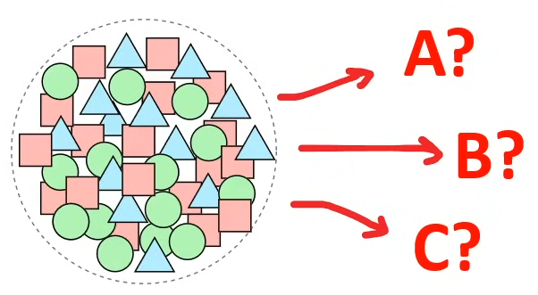
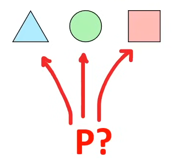
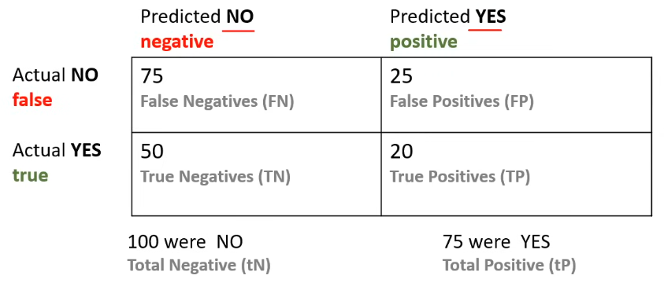

# ☁️ Microsoft AI 900 Fundamentals

* * *

[FreeCodeCamp](https://www.youtube.com/watch?v=hHjmr_YOqnU&t=2s)

## ⭐️ Contents ⭐️

## ☁️ Introduction

### 🎤 Introduction to AI-900

AI 900 is for those seeking an ML role such as AI Engineer or Data Scientist.

#### Skilled measured

**15-20%** Describe Artificial Intelligence workloads and considerations
- 6-9 questions

**20-25%** Describe fundamentals principles of machine learning on Azure
- 7-12 questions

**15-20%** Describe Features of computer vision workloads on Azure
- 6-9 questions

**15-20%** Describe features of Natural Language Processing (NLP) workloads on Azure
- 6-9 questions

**15-20%** Describe features of generative AI workloads on Azure
- 6-9 questions

There are ~37-47 questions. Can afford to get \*10-13 questions wrong
You get ~1min per question.

### 🎤 Exam Guide Breakdown

### ✅ Describe Artificial Intelligence workloads and considerations (15–20%)

- Identify features of common AI workloads
- Identify features of content moderation and personalization workloads
- Identify computer vision workloads
- Identify natural language processing workloads
- Identify knowledge mining workloads
- Identify document intelligence workloads
- Identify features of generative AI workloads

#### Identify guiding principles for responsible AI

- Describe considerations for fairness in an AI solution
- Describe considerations for reliability and safety in an AI solution
- Describe considerations for privacy and security in an AI solution
- Describe considerations for inclusiveness in an AI solution
- Describe considerations for transparency in an AI solution
- Describe considerations for accountability in an AI solution

### ✅ Describe fundamental principles of machine learning on Azure (20–25%)

- Identify common machine learning techniques
- Identify regression machine learning scenarios
- Identify classification machine learning scenarios
- Identify clustering machine learning scenarios
- Identify features of deep learning techniques

#### Describe core machine learning concepts

- Identify features and labels in a dataset for machine learning
- Describe how training and validation datasets are used in machine learning

#### Describe Azure Machine Learning capabilities

- Describe capabilities of automated machine learning
- Describe data and compute services for data science and machine learning
- Describe model management and deployment capabilities in Azure Machine Learning

### ✅ Describe features of computer vision workloads on Azure (15–20%)

#### Identify common types of computer vision solution

- Identify features of image classification solutions
- Identify features of object detection solutions
- Identify features of optical character recognition solutions
- Identify features of facial detection and facial analysis solutions

#### Identify Azure tools and services for computer vision tasks

- Describe capabilities of the Azure AI Vision service
- Describe capabilities of the Azure AI Face detection service

### ✅ Describe features of Natural Language Processing (NLP) workloads on Azure (15–20%)

#### Identify features of common NLP Workload Scenarios

- Identify features and uses for key phrase extraction
- Identify features and uses for entity recognition
- Identify features and uses for sentiment analysis
- Identify features and uses for language modeling
- Identify features and uses for speech recognition and synthesis
- Identify features and uses for translation

#### Identify Azure tools and services for NLP workloads

- Describe capabilities of the Azure AI Language service
- Describe capabilities of the Azure AI Speech service

### ✅ Describe features of generative AI workloads on Azure (15–20%)

#### Identify features of generative AI solutions

- Identify features of generative AI models
- Identify common scenarios for generative AI
- Identify responsible AI considerations for generative AI

#### Identify capabilities of Azure OpenAI Service

- Describe natural language generation capabilities of Azure OpenAI Service
- Describe code generation capabilities of Azure OpenAI Service
- Describe image generation capabilities of Azure OpenAI Service

* * *

## ☁️ `ML Introduction`

## ML and AI concepts

### Layers of Machine Learning

1.  Artificial Intelligence
    1.  Machine Learning
        1.  Deep Learning

What is Artificial Intelligence (AI)?
Machine that perform jobs that **mimic human behavior**.

What is Machine Learning (ML)?
Machine that get better at a task **without explicit programming**.

What is Deep Learning (DL)?
Machine that have an **artificial neural network** inspired by the human brain to solve complex problems.

What is Data Scientist ?
A person with **multi-disciplinary skills** in maths, statistic, predictive modeling and machine learning **to make future predictions**.

### Key Elements of AI

AI is the software that imitates human behavior and capabilities.

Key elements (according to Microsoft Azure):

- Machine Learning ML: the foundation of an AI system, learn and predict like a human.
- Anomaly detection: detect outliers or things out of place like a human.
- Computer vision: be able to see like a human.
- Natural Language Processing: be able to process human languages and infer context.
- Conversational AI: be able to hold a conversation with a human.

### DataSets

What is a dataset?
A data set is a **logical grouping of units of data** that are closely related and/or share the same data structure.
There are **public available data sets** that are used in the `learning of the statistic, data analytics, machine learning`.

#### MNIST dataset:

Images of **handwriting digits** used to test classification, clustering, and image processing algorithm.
Commonly used when learning how to build computer vision ML models to translate handwriting into digit text.

#### Common Object In Context (COCO) dataset.

A dataset which contains many common images using a JSON file (coco format) that identify objects or segments within an image.

\*\*This dataset features:

- Object segmentation
- Recognition in context
- Superpixel stuff segmentation
- 329k images (>200k labeled)
- 0.5 million object instances
- 79 objects categories
- 90 stuff categories
- 4 captions per image
- 249.00 people with keypoint

### Labeling

**What is Data Labeling?**
Is the process of **identify raw data** (images, text files, videos, etc) `and adding one or more meaningful and informative labels` to `provide context` so that a machine learning model can learn.

With `supervised machine learning`, labelling is a prerequisite to produce training data and **each piece of data will generally be labeled by a human**.

With `unsupervised machine learning`, **labels will be produced by the machine**, and may not be human readable.

**what is ground truth?**
A properly labeled dataset that you use as the objective standard to train and assess a given model is often called "ground truth". The accuracy of your trained model will depend on the accuracy of your ground truth.

### Supervised and Unsupervised Reinforcement

| Supervised | Unsupervised |
| --- | --- |
| **Supervised Learning**   Data that has been labeled for training.   Task-driven `make a prediction` | When the labels are known and you want a precise outcome.   When you need a specific value returned. eg. **Classification, Regression** |
| **Unsupervised Learning** Data has not been labeled, the ML model needs to do its own labeling.  Data-driven: `recognize a structure pattern` | When the labels are not known and the outcome does not need to be precise.  When you're trying to make sense of data. eg. **Clustering, Dimensionality Reduction, Association.** |
| **Reinforcement Learning**  There is no data, there is an environment and an ML model generates data nay many attempt to reach a goal.  Decisions-drive: `Game AI, Learning Tasks, Robot Navigation` |
|  |  |

### Neural Networks and Deep Learning
**What are Neutral Networks?  (NN)**
Often described as `mimicking the brain`, a **neuron/node represents an algorithm.**
Data is inputted into a neuron and based on the output the data will be passed to one of many other connected neurals.
The connection between neurons is **weighted**.
The network is organized in layers
There will be a input layer, 1 to many hidden layers and output layer.

**What is Feed Forward? (FNN)**
Neural Networks where connections between nodes do not form a cycle (always move forward).

**What is Backpropagation (BP)?**
Moves backwards through the neural network adjusting weights to improve outcome on next iteration. This is how a neural net learns.

**Loss Function**
A function that compares the ground truth to the prediction to determine the error rate (how bad the network performed).

**Activation Functions**
An algorithm applied to a hidden layer node that affects connected output eg. ReLu

**Dense**
When the next layer increases the amount of nodes

**Spare**
When the next layer decreases the amount of nodes.

### GPU - Graphics processing unit
**What is a GPU?**
A General Processing Unit (GPU) that is specially designed to quickly render high-resolution images and video  **concurrently**.

GPU can perform `parallel operations on multiple sets of data`, and so they are commonly used for **non-graphical tasks such as machine learning** and scientific computation.

- CPU can have average 4 to 16 processors cores.
- GPU can **thousands of processors cores** (4 to 8 GPUs can provide as many as 40,000 cores)

GPUs are best suited for repetitive and highly-parallel computing tasks:
- Rendering graphics
- Cryptocurrency mining
- Deep Learning and ML

### CUDA - Compute Unified Device Architecture
**What is NVIDIA?**
NVIDIA is a company that manufactures **graphical processing units (GPUs)** for gaming and professional markets.

**Wat is CUDA?** : Compute Unified Device Architecture (CUDA) is a `parallel computing platform` and `API` by NVIDIA that allows developers to use `CUDA-enabled GPUs` for general-purpose computing on GPUs (GPGPU).

All major deep learning frameworks are integrated with `NVIDIA Deep Learning SDK`.

The NVIDIA Deep Learning SDK is a collection of NVIDIA libraries for deep learning. One of those libraries is the `CUDA Deep Neural Network library (cuDNN)`.
cuDNN provides highly tuned implementations for standard routines such as:
- forward and backward convolution
- Pooling
- Normalization
- activation layers

### Simple ML Pipeline

### Forecast vs Prediction

| What is **Forecasting?** | What is a **Prediction?** |
| --- | --- |
|  |  |
| - Makes a future prediction with **relevant data** - analysis of trends - its not "guessing"  | - Makes a future prediction **without relevant data** - uses statistics to predict future outcomes - its more of "guessing" - Uses decision theory |
|  |  |

### Evaluation Metrics
**Performance/Evaluation Metrics** are used to evaluate different Machine Learnings Algorithms

For different types of problems different metrics matter, (this is not an exhaustive list)
- Classification Metrics (accuracy, precision, recall, F1-score, ROC, AUC)
- Regression Metrics (MSE, RMSE MAE)
- Ranking Metrics (MRR, DCG, NDCG)
- Statistical Metrics (Correlation)
- Computer Vision Metrics (PSNR, SSIM, IoU)
- NLP Metrics (Perplexity, BLEU, METEOR, ROUGE)
- Deep Learning Related Metrics (Inception score, Frechet Incepton distance)

There are two categories of evaluation metrics:
- Internal evaluation: metrics used to evaluate the internals of the ML model
    - Accuracy, F1-score, Precision, Recall (the famous four) used in all kind of models
- External Evaluation: metrics used to evaluate the final prediction of the ML model.

### Jupyter Notebooks
A web-based application for authoring documents that combine:
- live-code
- narrative text
- equations
- visualizations

iPython's notebook feature became Jupyter Notebook

Jupyter Notebooks were overhauled and better integrated into an IDE called **JupyterLab**
- you generally want to open Notebooks in Labs. The legacy web-based interface is known as **Jupyter classic notebook**

`JupyterLab` is a **next-generation web-based user interface**

All the familiar features of the classic Jupyter Notebook in a flexible and powerful user interface:
- notebook
- terminal
- text editor
- file browser
- rich output

JupyterLab will eventually replace the classic Jupyter Notebook.

### Regression
**Regression** is a process of finding a function to `correlate a labeled dataset into continuous variable/number`.

Outcome: Predict this **variable** in the future. eg. what will be the temperature.

Vector (dots) are plotted on a graph in multiple dimension eg (X,Y). A regression line is drawn trough the dataset.

The **distance** of the vector from the regression line is calles **Error**.

Different **Regression algorithms** use the error to predict future variables:
- Mean squared error (MSE)
- Root mean squared error (RMSE)
- Mean absolute error (MAE)

### Classification
**Classification** is a process of finding a function to `divide a labeled dataset into classes/categories`.

Outcome: Predict **category** to apply to the inputted data. eg. Will it rain next Saturday? sunny, rainy.

A **classification line** divides the dataset.

**Classification Algorithms**:
- Logistic Regression
- Decision Tree/Random Forest
- Neural Networks
- Naive Bayes
- K-Nearest Neighbors
- Support Vector Machines

### Clustering
**Clustering** is a process **grouping unlabeled data based on similarities and differences**.

Outcome: Group data based on similarities and differences.

**Clustering Algorithms**:
- k-means
- k-medoids
- Density Based
- Hierarchical

### Confusion Matrix
A confusion matrix is a table to visualize the **model predictions** (predicted) vs **ground truth labels** (actual). Also known as an error matrix. They are useful in classification problems.

The size of the matrix is dependent on the labels: apple, banana, orange 3x2=6 cells

* * *

## ☁️ `Common AI Workloads`
### Anomaly Detection AI
**What is an anomaly?**
An abnormal thing; a marked deviation from the norm or a standard.

**What is anomaly detection?**
Anomaly Detection is the process of finding outliers within a dataset called `anomaly`. Detecting when a piece of data or access patterns appear suspicious or malicious.

Use cases for anomaly detection:
- Data cleaning
- `intrusion detection`
- `Fraud detection`
- System health monitoring
- Event detection in sensor networks
- Ecosystem disturbances
- Detection of critical and cascading flaws

Anomaly detection by hand is a very tedious process. Using machine learning for Anomaly detection is more efficient and accurate.

Azure has **Anomaly detector**. Detect anomalies in data to quickly identify and troubleshoot issues.

### Computer Vision AI
**Computer Vision** is when we use Machine Learning Neural Networks to `gain high-level understanding from digital images or video`.

**Computer Vision Deep Learning Algorithms**:
- **Convolutional neural network (CNN)**: images and video recognition
    - inspired after how human eyes actually process information and send it back to brain to be processed.
- **Recurrent neural network (RNN)**: handwriting recognition or speech recognition.

Types of Computer Vision_
- **Image Classification**: look at image or video and classify (place it in a category)
- **Object Detection**: identify objects within an image or video and apply labels and location boundaries
- **Semantic Segmentation**: identify segments or objects by drawing pixel mask (great for objects in movement)
- **Image Analysis**: analyze an image or video to apply descriptive and context labels
- **Optical Character Recognition**: find text in images or videos and extract them into digital text for editing
- **Facial Detection**: detect faces in a photo or video, draw a location boundary, label their expression.

**Seeing AI** is an AI app developed by Microsoft for iOS.

#### Azure's Computer Vision Service Offering:
- Computer Vision
- Custom Vision
- Face
- Form Recognizer

### Natural Language Processing AI
**Natural Language Processing** is a Machine LEarning that can `understand the context of a corpus (a body of related text)`.

NLP enables you to:
- analyze and interpret text within documents, email message
- interpret or contextualize spoken token
- synthesize speech. eg a voice assistant talking to you
- automatically translate spoken or written phrases and sentences between languages
- interpret spoken or written commands and determine appropriate actions

**Cortana** is a `Virtual assistant`developed by Microsoft.

**Azure's NLP Service Offering:**
- Text Analytics:
- Translator
- Speech
- Language Understanding (LUIS)

### Conversational AI
Conversational AI is a technology that can `participate in conversations with humans`.
- chatbots
- voice assistants
- interactive voice recognition system (IVRS)

Uses Cases:
- online customer support
- accessibility
- HR processes
- Health Care
- Internet of Things (IoT)
- Computer Software

**Azure's Conversational AI Service Offering:**

- QnA Maker: create a conversational question-and-answer bot
- Azure Bot Service: intelligent, serverless bot service that scales on demand.

User can make the bot with QnA Maker and deploy it on Azure Bot Service.

## ☁️ `Responsible AI`
### Responsible AI
**Responsible AI** focuses on ethical, transparent and accountable use of AI technologies.

Microsoft  put into practice Responsible AI via its six **microsoft AI Principles**:
1. Fairness
2. Reliability and Safety
3. Privacy and Security
4. Inclusiveness
5. Transparency
6. Accountability (responsibility)

### Fairness
**AI systems should treat all people fairly**

AI systems can reinforce existing societal stereotypical.

Bais can be introduced during the development of a pipeline.

AI systems are used to allocate or withhold:
- opportunities
- resources
- Information

In domains:
- Criminal justice
- Employment and Hiring
- Finance and credit

**Azure ML can tell you how each feature can influence a model's prediction for bais**.

### Reliability and safety
**AI systems should perform reliably and safely**

AI software must be `rigorous tested` to ensure they work as expected before release to the end user.

If there are scenarios where AI is making mistakes its important to release a report **quantifies risks and harms** to end-users so they are informed of the short-coming of an AI solution.

AI where concern for reliability and safety for humans is critically important:
- Autonomous vehicles
- AI health diagnosis, AI suggesting prescriptions
- Autonomous Weapons System

### Privacy and security
**AI systems should be secure and respect privacy**

AI can require vast amounts of data to train Deep Learning ML models. The nature of the ML model may require **Personally identifiable information (PII)**

It is important that we ensure protection of user data that is not leaked or disclosed.

In some cases ML Models can be run locally on a user's device so their PII  remains on their device avoiding that vulnerability.

AI Security Principles to detect malicious actors:
- Data origin and lineage
- Data use internal vs external
- Data corruption considerations.

### Inclusiveness
**AI systems should empower everyone and engage people**

If we can design AI solutions for the minority of users, then we can design AI solutions for the majority of users.

**Minority Groups**:
- physical ability
- gender
- sexual orientation
- ethnicity
- other factors

### Transparency
**AI systems should be understandable**

Interpretability / Intelligibility is when end-users can understand the behavior of the UI.

Transparency of AI systems can result in:
- mitigating unfairness
- help developers debug their AI system
- gaining more trust from our users

Those build AI systems should be:
- open about the why are using AI
- open about the limitations of their I system

Adopting an open-source AI framework can provide transparency ( at least from a technical perspective) on the internal working of an AI systems.

### Accountability (responsibility)
**AI systems should be accountable for AI systems**

The structure put in place to consistently enacting AI principles and taking them into account.

AI systems should work within:
- framework of governance
- organizational principles

ethical and legal standards that are clearly defined.

Principles guide Microsoft on how they `Develop, Sell and Advocate`when working with third-parties and this can push towards regulations towards AI principles.

### Guidelines for Human AI Interaction
Microsoft has a free web-app that goes through **practical scenarios** to teach Microsoft AI Principles.

* * *

## ☁️ `Cognitive Services`

### Azure Cognitive Services
**Azure Cognitive Services** is a `comprehensive family of AI services`and cognitive APIs to help you build intelligent apps.

Create customizable, pre-trained models built with *breakthrough* AI research.

Deploy Cognitive Services anywhere from the cloud to the edge with containers.

Get started quickly - no machine-learning expertise required

Developed with strict ethical standards, empowering responsible use with industry-leading tools and guidelines.

**`Decision`**
- **Anomaly Detector**: identify potential problems early on.
- **Content Moderator**: Detect potentially offensive or unwanted content.
- **Personaliser**: Create rich, personalized experiences for every user.

**`Language`**
- **Language Understanding**: build natural language understanding into apps, bots and IoT devices.
- **QnA Maker**: create a conversational question and answer layer over your data.
- **Text Analytics**:  detect sentiment, key phrases and named entities.
- **Translator**: detect and translate more than 90 supported languages.

**`Speech`**
- **Speech to text**: transcribe audible speech into readable, searchable text.
- **Text to Speech**: convert text to lifelike speech for more natural interfaces.
- **Speech Translation**: integrate real-time speech translation into your apps.
- **Speakers Recognition**: identify and verify the people speaking based on audio.

**`Vision`**
- **Computer vision**:  analyze content in images and video
- **Custom vision**: customize images recognition to fit your business needs.
- **Face**: detect and identify people and emotions in images.

****

### Cognitive API Key and Endpoint
Cognitive Services is an umbrella AI service that enables customers to **access multiple AI services** with an `API jey and API endpoint`.

### Knowledge Mining
**Knowledge Mining** is a `discipline`in AI that uses a **combination of intelligent services to quickly learn from vast amounts of information**.

It allows organizations to deeply understand and easily explore information, uncover hidden insights, and find relationships and patterns at scale.

**Ingest**: content from a range of sources, using connectors to first and third-party data stores.

- Structures:
    - databases
    - CSV
- Unstructured:
    - pdf, video, image, audio

**Enrich**: the content with AI capabilities that let you extract information, find patterns, and deepend understanding.

- cognitive services:
    - vision
    - language
    - speech
    - decision
    - search

**Explore**: the newly indexed data via search, bots, existing business applications, and data visualization.
- Enrich, Structured Data:
    - customer relationship management (CRM)
    - RAP Systems
    - Power BI

### Face Service
Azure Face service provides AI algorithms that **detect, recognize, and analyze human faces** in image.

Azure Face can detect:
- faces in an image
- faces with specific attributes
- face landmarks (there are up to 27 different landmarks)
- similar faces
- the same face as a specific identity across a gallery of images

**Face Attributes**:
- accessories
- age
- blur
- emotions
- exposure
- Facial hair
- gender
- glasses
- hair
- head pose
- makeup
- mask
- noise
- occlusion (object blocking parts of the face)
- smile

### Speech and Translate Service
Azure's Translate service is a `translation service`.
- it can translate 90 languages and dialects
- it uses Neutral Machine Translation (NMT) replacing its legacy Statistical Machine Translation (SMT)
- **Custom Translator** allows you to extend the service for translation based on your business and domain use case.

Azure Speech Service can `speech synthesis service` speech-to text, text-to-speech, and speech-translation.

Speech-to-text:
- real-time speech-to-text
- batch speech-to-text
- multi-device conversation
- conversation transcription
- create custom speech models

Text-to-speech
- using Speech Synthesis Markup Language (SSML)
- create custom voices

Voice Assistance
- integrates with Bot Framework SDK

Speech Recognition
- speaker verification & identification

### Text Analytics
Text Analytics API is a **Natural Language Processing (NLP)** service for `text mining and text analysis`.

Text Analytics can perform:
- sentiment analysis:
    - find out what people think of your brand or topic. provides sentiment labels (negative, neutral and positive or mixed)
    - confidence scores ranging from 0 to 1
- opinion mining
    - aspect-based sentiment analysis
    - granular information about the opinions related to aspects
- key phrase extraction
    - quickly identify the main concepts in text
- language detection
    - detect the language an input text is written in
- named entity recognition (NER)
    - identify and categorize entities in your text as people, places, organizations, quantities
    - subset of NER is Personally Identifiable Information (PII)

### Optical Character Recognition (OCR)
Optical Character Recognition (OCR) is the process of **extracting printed or handwritten text into a digital and editable format**.

OCR can be applied to:
- photos of street sings
- products
- documents
- invoices
- bills
- financial reports
- articles
- and more

Azure has **two different APIs** that can perform OCR: `OCR API and Read API`

| OCR API | Read API |
| --- | --- |
|- older recognition  - supports only images  - executes synchronously  - support more languages  - easier to implement  | - updated recognition model  - supports images and PDFs  - executes asynchronously  - supports fewer languages  - a bit more difficult to implement

OCR is performed via the **Computer Vision SDK**

### Form Recognizer
Azure Form Recognizer is a **specialize ORC service** (translates printed text into digital and editable content) and `preserves that structure and relationship of form-like data`.

Form Recognizer to **automate data entry** in your applications and **enrich your documents search capabilities**.

Form Recognizer can identify:
- key value pairs
- selection marks
- table structures

Form Recognizer outputs structures such as:
- original file relationships
- bounding boxes
- confidence scores

Form Recognizer is composed of:
- custom document processing models
- prebuilt models for invoices, receipts, IDs, business cards.

### Form Recognizer Custom Models
Custom models allows you to **extract text, key/value pairs, selection marks, and table data** from forms.

- these models are trained with your own data, so they're tailored to your forms
- you only need five sample input forms to start
- a trained document processing model can output structured data that includes the relationship in the original form document
- after you train the model, you can test and retrain it and eventually use it to reliably extract data from more forms according to your need.

There are 2 learning options:
| **Train without Labels** | **Train with Labels** |
| --- | --- |
| uses `unsupervised learning`to understand the layout and relationships between field and entries in your forms | uses `supervised learning` to extract values on interest, using the labeled forms you provide (trained data).

### Form Recognizer Prebuilt Models
- receipts
- business cards
- invoices
- identity documents (IDs)

### Language Understanding Service - LUIS
Language Understanding Service (LUIS) is a **no-code ML service to build natural language into apps**, bots, and IoT devices.

Quickly create enterprise-ready, custom models that continuously improve.

LUIS is accessed via its own isolate domain at luis.ai.

It utilizes Natural Language Model (NLP) and **Natural Language Understanding (NLU)

NLU is the ability to transform a linguistic statement to a representation that enables you to understand your users naturally.

LUIs is intended to focus on intention adn extraction:
- what the user wants
- what they are talking about

LUIS application is composed of a **schema**:
- intentions
- entities
- utterances

**Intentes** `classify` user utterances

**Entities** `extract` data from utterances

### QnA Maker

QnA Maker is a **cloud-based Natural Language Processing (NLP) service** that allows you to `create a natural conversational layer` over your data.

QnAMaker is hosted on its own isolate domain at www.qnamaker.ai

It will find the most appropriate answer for any input from your **custom knowledge base (KB)** of information

Commonly used to build conversational client applications, which include:
- social media applications
- chat bots
- speech-enabled desktop applications

QnA Maker doesn't store customer data
All customer data is stored in the region the customer deploys the dependent service instances in.

The chit-chat feature in QnA maker allows you to easily add a pre-populated set of the top chit-chat, into your knowledge base.

This dataset has about 100 scenarios of chit- chat in the voice of multiple personas

### Azure Bot Service
**Azure Bot Service** intelligent, serverless bot service that scales on demand. Used for `creating, publishing, and managing bots.

You can **register and publish** a variety of bots from the Azure Portal.

Azure Bot Service can integrate your bot with other Azure, Microsoft or Third Party services via Channels:
- Direct Line
- Alexa
- Office 365 email
- Facebook
- Kik
- LINE
- Microsoft Teams
- Skype
- Twilo

The Bot Framework SDK v4 is an **open-source SDK** that enable developers to `model and build sophisticated conversations`

The Bot Framework, along with the Azure Bot Service, provides and end-to-end workflow:

**Bot Framework Composer**, built on the Bot Framework SDK, is an `open-source IDE for developers` **to author, test, provision and manage** conversational experiences.

* * *

## ☁️ `ML Studio`

### Azure Machine Learning Service
**Azure Machine Learning Studio (classic)**

An older service that manages AI/ML workloads. Does not have a pipeline and other limitations. Workloads are not easily transferable to from classic to the new service.

#### **Azure Machine Learning Service**
A service that simplifies running AI/ML related workloads allowing you to build flexible Automated ML Pipelines. Use Python or R, Run DL workloads such as Tensorflow

Jupyter Notebooks
- build and document your machine learning models as you build them, share and collaborate

Azure Machine Learning SDK for Python
- An SDK designed specifically to interact with Azure Machine Learning Services

MLOps
- end to end automation of ML model pipelines eg. CI/CD, training, inference

Azure Machine Learning Designer
- drag and drop interface to visually build, test, and deploy machine learning models

Data Labeling Service
- ensemble a team of humans to label your training data

Responsible Machine Learning
- model fairness through disparity metrics and mitigate unfairness

### Studio Overview

**Author**

Notebooks: Jupyter Notebooks, an IDE to write python code to build ML models
AutoML: Completely automated process to build and train an ML model
Designer - Visual drag and drop designer to construct end to end ML pipelines

**Assets**

Datasets: data that you upload which will be used for training
Experiments - when you run a training job they are detailed here
Pipelines - ML workflows you have built, or you have used in the Designer
Models - a model registry containing trained models that can be deployed
Endpoints - when you deploy a model its hosted on an accessible endpoint eg. REST API

**Manage**

Compute - the underlying computing instances used to for notebooks, training, inference
Environments - a reproducible Python environment for machine learning experiments
Datastores - a data repository where your dataset resides
Data Labeling - have humans with ML-assisted labeling to label your data for supervised learning
Linked Services — external services you can connect to the workspace eg. Azure Synapse Analytics

### Studio Compute
Azure Machine Learning Studio has **4 kinds of compute:**

1. Compute Instances - Development workstations that data scientists can use to work with data and models.
2. Compute Clusters - Scalable clusters of virtual machines for on-demand processing of experiment code.
3. Inference Clusters — Deployment targets for predictive services that use your trained models.
4. Attached Compute - Links to existing Azure compute resources, such as Virtual Machines or Azure Databricks clusters.

### Studio Data Labeling

Create Data labeling jobs to prepare your Ground Truth for supervised learning

**Human-in-the-loop labeling** You have a team of humans that will apply labeling These are humans you grant access to labeling

**Machine-learning-assisted data labeling** You will use ML to perform labeling

You can export the label data for Machine Learning experimentation at any time Users often export multiple times and train different models, rather than wait for all the images to be labeled.

Image labels can be exported in:
- COCO format
- Azure Machine Learning dataset
    - dataset format makes it easy to use for training in Azure Machine Learning

### Data Stores
**Datastores `securely connect to your storage service`** on azure without `putting your authentication credentials`and the integrity of your original data source **at risk**.

**Azure Blob Storage**
data is stored as objects, distributed across many machines

**Azure File Share**
a mountable file share via SMB and NFS protocols

**Azure Data Lake Storage (Gen 2)**
Azure Blob storage designed for vasts amount of data for Big Data analytics

**Azure SQL database**
Full-managed MS SQL relational database

**Azure Postgres database**
open-source relational database

**Azure MySQL Database**
Open-source relational database
HD

### Datasets
Azure ML Dataset makes it **easy to register your datasets** for use with your ML workloads.

you can upload new datasets and they will be **versioned**.

Azure provides a same code snippet with the Azure Machine Learning SDK for Python to start programmatically using datasets in your Jupyter Notebooks

### Experiments
**Experiments** is a `logical grouping Azure Runs`

**Runs** are the **act of running an ML task** on a virtual machine or container

### Pipelines

**Azure ML Pipelines** is an `executable workflow` of a complete machine learning task

Subtasks are encapsulated as a series of steps within the pipeline

Independent steps allow multiple data scientists to work on the same pipeline at the same time without over-taxing compute resources

Separate steps also make it easy to use different compute types/sizes for each step.

When you rerun a pipeline, the run jumps to the steps that need to be rerun, such as an updated training script.

Steps that do not need to be rerun are skipped

After a pipeline has been published, you can configure a REST endpoint, which allows you to rerun the pipeline from any platform or stack

You can build pipelines two ways:
- Using the Azure Machine Learning Designer
- **Programmatically using the Azure Machine Learning Python SDK**

### ML Designer

The Azure Machine Learning Designer lets you `quickly build Azure ML Pipelines`** without having to write code.**

You can **drag out various templated steps** called assets to quickly prototype your pipeline

### Model Registry

**Model Registry** allows you to `create, manage and track your registered models` as incremental versions under the same name

Each time you register a model with the same name as an existing one, the registry assures that **it's a new version**.

Additionally, you can provide metadata tags and use the tags when you search for models.

### Endpoints

**Azure ML Endpoints** allow you to `deploy machine learning models as a web service`

The workflow for deploying a model:
- Register the model
- Prepare an entry script
- Prepare an inference configuration
- Deploy the model locally to ensure everything works
- Choose a compute target
- Re-deploy the model to the cloud
- Test the resulting web service

**Realtime endpoints**
An endpoint that provides remote access to invoke the ML model service running on either:
- Azure Kubernetes Service (AKS)
- Azure Container Instance (ACI)

**Pipeline endpoints**
An endpoint that provide remote access to invoke an ML pipeline.

You can parametrize the pipeline endpoint for managed repeatability in batch scoring and retraining scenarios.

### Notebooks
Azure has a built in **Jupyter-like NotebooK editor** so you can build and train your ML model

- choose compute
- choose kernel

* * *

## ☁️`AutoML`

### Introduction to AutoML

**Automated machine learning (AutoML)** `automates the process of creating an ML model.`

With Azure AutoML you
- supply a dataset
- Choose a Task Type (Classification, Regression or Time Series Forecasting)
- Then AutoML will train and tune your model

**Classification**
When you need to make a prediction based on several classes:
- binary classification: Yes or No
- multi-class classification: Red, Green, Blue

**Regression**
When you need to predict a continuous number value

**Time Series Forecasting**
When you need to predict the value
based on time

**Classification** is a type of **supervised learning** in which `models learn using training data`, and apply those learnings to new data.

The goal of classification models is to **predict which categories new data will fall into** based on learnings from its training data:
- **binary classification**: a record is labeled out of two possible labels eg: true or false
- **multiclass classification**: a record is labeled out of range of labels: happy, sad, mad, rad

**Regression** is a type of `supervised learning` in which models learn using training data, and apply those learnings to new data.

The goal of regression is to predict a variable in the future

Forecast revenue, inventory, sales, or customer demand

An automated time-series experiment is treated as **a multivariate regression problem**

Past time-series values are "pivoted" to become additional dimensions for the regressor together with other predictor

unlike classical time series methods, has an advantage of naturally incorporating multiple contextual variables and their relationship to one another during training

### Data Guard Rails

Data guardrails are run by Azure AutoML when `**automatic featurization**` is enabled.

A **sequence of checks** to `ensure high quality input data` is being used to train model.

### Automatic Featurization

During model training with AutoML, one of the following **scaling or normalization techniques** will be applied to each model

**StandardScaleWrapper** - Standardize features by removing the mean and scaling to unit variance

**MinMaxScalar** - Transforms features by scaling each feature by that column's minimum and maximum

**MaxAbsScaler** -Scale each feature by its maximum absolute value

**RobustScalar**-Scales features by their quantile range

**Principal component analysis (PCA)** - Linear dimensionality reduction using Singular Value Decomposition of the data to project it to a lower dimensional space

**TruncatedSVDWrapper** -This transformer performs linear dimensionality reduction by means of truncated singular value decomposition (SVD). Contrary to PCA, this estimator does not center the data before computing the singular value decomposition, which means it can work with scipy.sparse matrices efficiently

**SpareNormalizer**

### Model Selection

**Model selection** is the `task of selecting a statistical model` from a set of **candidate models**

Azure AutoML will use **many different ML Algorithms** and will recommend the best **performing candidate**

### Explanation

**ML Explainability (MLX)** is the process of `explaining and interpreting` ML and deep learning models. MLX can help machine learning developers to better understand and interpret the model's behavior

After your top candidate model is selected by Azure AutoML you can get an explanation of the internals on various factors:

### Primary Metrics

The primary metric parameter determines the metric to be used during model training for optimization.

| **Classification** | **Regression and Time Series Forecasting** |
| --- | --- |
| accuracy | spearman_correlation |
| AUC_weighted | normalized_root_mean_squared_error |
| average_precision_score_weighted | r2_score |
| norm_macro_recall | normalized_mean_absolute_error |
| precision_score_weighted |  |

**Classification Scenarios**
- Suited for larger datasets that well-balanced
    - accuracy - Image classification, Sentiment analysis, Churn prediction
    - average_precision_score_weighted- Sentiment analysis
    - norm_macro_recall: Churn prediction
    - precision_score_weighted

- Suited for small dataset that are imbalanced
    - AUC_weighted: Fraud detection, Image classification, Anomaly detection/spam detection

**Regressions Scenarios**
- Works well when value to predict encompasses a large range eg. 10K to 200K
    - spearman_correlation
    - r2_score - Airline delay, Salary estimation, Bug resolution time
- Works well when value to predict encompasses as smaller range eg. 10-20K
    - normalized_root_mean_squared_error — Price prediction (house/product/tip), Review
score prediction
    - normalized_mean_absolute_error

**Time Series Scenarios**

same as regression

### Validation Type

**Model Validation** is when we `compare the results of our training dataset to our test dataset`.

Model Validation occurs after we train the model

* * *

## ☁️ `Custom Vision`

### Introduction to Custom Vision

Custom Vision is a **fully-managed no-code** service to quickly build your own C`lassification and Object Detection ML models.`

This service is hosted on its own isolate
domain at `www.customvision.ai`

**Upload Images**
Bring your own labeled images, or use Custom Vision to quickly add tags to any unlabeled images.

**Train**
Use your labeled images to teach Custom Vision the concepts you care about.

**Evaluate**
Use simple REST API calls to quickly tag images with your new custom computer vision model.

### Project Types and Domains
Within Custom Vision you setup projects and you need to select a **Project Type**

**Classification**
- **Multi-label**
    - When we want to apply many tags to an image
        - Image contains both a Cat and a Dog
- **Multi-class**
    - when we only have one possible tag to apply to an image:
        - It is either a Apple, Banana, Orange
- **Object Detection**
    - When we to detect various objects in an image

### Custom Vision Features

**For Image Classification** you upload multiple images and you apply a single or multiple labels to the entire image.

**For Object Detection** you apply tags to objects in an image for data labeling

When you **hover your cursor over the image** Custom Vision uses ML to show bounding boxes of possible objects but yet have no label applied

When you are ready to train you model you have two options:
- **Quick Training** - trains quickly but can be less accurate
- **Advanced Training **– increase the compute time to improve your results

Once the **Classification** training job is complete we will get a report of the evaluation metrics **outcome**

**Precision**
- being exact and accurate
- select items that are relevant

**Recall** (Sensitivity or True Positive Rate)
- How many relevant items returned

**Average Precision (AP)**

Once the **Object Detection** training job is complete we will get a report of the evaluation metrics **outcome**
- Precision
- Recall
- Mean Average Precision (MAP)

* * *

## ☁️ `Features of generative AI solutions`

### AI vs Generative AI
#### **Artificial Intelligence**

Al refers to the development of computer systems that can **perform tasks typically requiring human intelligence**. These include `problem-solving, decision-making, understanding natural language, recognizing speech and images`, and more.

The primary goal of traditional Al is to create systems that can **interpret, analyze, and respond to human actions** or environmental changes efficiently and accurately. It aims to replicate or simulate human intelligence in machines.

Al applications are vast and include areas like **expert systems, natural language processing, speech recognition, and robotics.**

Al is used in various industries for tasks such as `customer service chatbots, recommendation systems in e-commerce, autonomous vehicles, and medical diagnosis.`

#### **Generative Al**

Generative Al is a subset of Al that focuses on **creating new content or data** that is novel and realistic. It does not just interpret or analyze data but generates new data itself. It includes **generating text, images, music, speech, and other forms of media.**

It often involves advanced machine learning techniques, particularly deep learning models like **Generative Adversarial Networks (GANs), Variational Autoencoders (VAEs), and Transformer models (like GPT).**

Generative Al is used in a range of applications including creating realistic images and videos, generating human-like text, composing music, creating virtual environments, and even drug discovery.

**Examples**: Tools like `GPT (Generative Pre-trained Transformer)` for text generation, DALL-E for image creation, and various deep learning models that compose music.

### What is a LLM Large Language Model

A Large Language Model (LLM) such as GPT (Generative Pre-trained Transformer) works in a way that's similar to a complex, **automatic system that recognizes patterns and makes predictions.**

**Training on Large Datasets**: Initially, the model is trained Natural Input (Prompt) on massive amounts of text data. This data can include **books, articles, websites, and other written material.**

During this training phase, the model learns patterns in language, such as grammar, word usage, sentence structure, and even style and tone.

**Understanding Context**: The model's design allows it to consider a wide context. This means it doesn't just focus on single words, but understands them in `relation to the words and sentences` that come **before and after**. This context understanding is important for generating coherent and relevant text.

### Transformer models

A transformer model is a type of machine learning model that's especially good at **understanding and generating language.**

It's built using a structure called the transformer architecture, which is really effective for tasks involving **natural language processing (NLP), like translating languages or writing text.**

Transformer model architecture consists of **two components**, or blocks:

1. Encoder: This part reads and understands the input text. It's like a smart system that
goes through everything it's been taught (which is a lot of text) and picks up on the
meanings of words and how they're used in different contexts.

2. Decoder: Based on what the encoder has learned, this part generates new pieces of text.
It's like a skilled writer that can make up sentences that flow well and make sense.

### Tokenization

**Tokenization** in a transformer model is like turning a sentence into a puzzle. For example, you have the sentence: **"I heard a dog bark loudly at a cat."** To help a computer understand it, we chop up the sentence into pieces called `'tokens'`. Each piece can be a word or even a part of a word.
So, for our sentence, we give each word a number, like this:

Now, our sentence becomes a series of numbers: **[1, 2, 3, 4, 5, 6, 7, 3, 8]**. This is like giving each word a special code.
The computer uses these codes to l**earn about the words and how they fit together.**
If a word repeats, like "a", we use its code again instead of making a new one.

### Embeddings

To help a computer understand language, we turn words into tokens and then give each token a special **numeric code**, called an `embedding`. These embeddings are like a secret code that captures the meaning of the word. As a simple example, suppose the embeddings for our tokens consist of `vectors` with three elements, for example:

Words that have **similar meanings** or are used in similar ways get **codes that look alike**.
So, "dog" and "bark" might have similar codes because they are `related`.

This way, the computer can figure out which words are **similar to each other** just by looking at their codes. It's like giving each word a home on a map, and words that are neighbors on this map have related meanings

### Positional encoding

Positional encoding is a technique used to ensure that a language model, such as GPT
(Generative Pre-trained Transformer) doesn't lose the **order of words** when processing natural language. This is important because the order in which words appear can change the meaning of a sentence.

Without positional encoding, if we simply tokenize this sentence and convert the tokens into embedding vectors, we might end up with a set of vectors that **lose the sequence** information

### Attention

Attention in Al, especially in transformer models, is a way the model figures out **how important each word (or token) is to the meaning of a sentence,** particularly in relation to the other words around it.

* * *

## ☁️ `Capabilities of Azure OpenAI Service`

### Introduction to Azure OpenAI Service

Azure OpenAl Service is a cloud-based platform designed to **deploy and manage advanced language models from OpenAI**. This service combines OpenAl's latest language model developments with the robust security and scalability of Azure's cloud infrastructure.

Azure OpenAl offers several **types of models** for different purposes:
- **GPT-4 Models:** These are the newest in the line of GPT models and can create `text and programming code` when given a prompt written in natural language.
- **GPT-3.5 Models:** Similar to GPT-4, these models also create text and code from natural language prompts. The GPT-3.5-turbo version is specially designed for `conversations`, making it a great choice for *chat applications and other interactive Al tasks*.
- **Embedding Models**: These models turn written `text into number sequences`, which is helpful for analyzing and comparing different pieces of text to find out how similar they are.
- **DALL-E Models**: These models can make `images from descriptions` given in words. The DALL-E models are still being tested and aren't shown in the Azure OpenAl Studio, so you don't have to set them up for use manually.

**Key concepts** in using Azure OpenAl include prompts and completions, tokens, resources, deployments, prompt engineering, and various models:

**Prompts & Completions**: Users interact with the API by providing a text command in English,
known as a **prompt**, and the model generates a text response, or completion.
- E.g., a prompt to count to five in a loop results in the model returning appropriate code.

**Tokens**: Azure OpenAl breaks down text into tokens, which are words or character chunks, to
process requests. The number of tokens affects response latency and throughput.
- For images, token cost varies with image size and detail setting, with low-detail images costing fewer tokens and high-detail images costing more.

**Resources**: Azure OpenAl operates like other **Azure products** where users create a resource within their Azure Subscription.

**Deployments**: To use the service, users must deploy a model via Deployment APIs, choosing the specific model for their needs.

**Prompt Engineering**: Crafting prompts is crucial as they guide the model's output.
This requires skill, as prompt construction is nuanced and impacts the model's response.

**Models**: Various models offer different capabilities and pricing. **DALL-E** creates images from text, while **Whisper** transcribes and translates speech to text. Each has unique features suitable for different tasks.

### Azure OpenAI Studio

Developers can work with these models in `Azure OpenAI Studio`, a **web-based environment** where Al professionals can **deploy, test, and manage LLMs** that support generative Al app development on Azure.

Access is currently **limited** due to the high demand, upcoming product improvements, and Microsoft's commitment to
responsible AI.

Presently, collaborations are being prioritized for those who already have a **partnership with Microsoft**, are engaged in lower-risk use cases, and are dedicated to including necessary safeguards.

### Azure OpenAI service pricing
| Models               | Context | Prompt (Per 1,000 tokens) | Completion (Per 1,000 tokens) |
|----------------------|---------|----------------------------|--------------------------------|
| GPT-4                | 8K      | $0.03                      | $0.06                          |
| GPT-4                | 32K     | $0.06                      | $0.12                          |
| GPT-3.5-Turbo        | 4K      | $0.0015                    | $0.002                         |
| GPT-3.5-Turbo        | 16K     | $0.003                     | $0.004                         |
| GPT-3.5-Turbo-1106   | 16K     | N/A                        | N/A                            |
| GPT-4-Turbo          | 128K    | N/A                        | N/A                            |
| GPT-4-Turbo-Vision   | 128K    | N/A                        | N/A                            |

### Base models
| Models       | Price (per 1,000 tokens) |
|--------------|---------------------------|
| Babbage-002  | $34                       |
| Davinci-002  | $68                       |

### Fine-tuning models
| Models    | Training Resolution | Usage Resolution | Quality | Price (per 1,000 tokens) |
|-----------|---------------------|------------------|---------|---------------------------|
| Dall-E-3  | Standard (1024*1024)| 1024*1792        | Standard| $4                        |
| Dall-E-3  | HD (1024*1024)      | 1024*1792        | HD      | $8                        |
| Dall-E-2  | Standard (1024*1024)| 1024*1792        | -       | $2                        |

### Image models
| Models       | Price (per 100 images) |
|--------------|-------------------------|
| Dall-E-3     | $0.0004                 |
| Dall-E-3     | $0.002                  |

### Embedding models
| Models       | Price (per 1,000 tokens) |
|--------------|---------------------------|
| Babbage-002  | $0.0004                   |
| Davinci-002  | $0.002                    |
| Ada          | $0.002                    |
| GPT-3.5-Turbo| $0.002                    |

### Speech models
| Models   | Price (per hour) |
|----------|-------------------|
| Whisper  | $0.36             |

### What are Copilots

**Copilots** are a new type of computing tool that integrates with applications to help users with `common tasks using generative Al models`. They are designed using a standard architecture, allowing developers to create **custom copilots** tailored to specific business needs and applications.
- Copilots might appear as a chat feature beside your document or file, and they **utilize the content within the product to generate specific results.**

Creating a copilot involves several steps:
1. Training a **large language model** with a vast amount of data.
2. Utilizing services like **Azure OpenAl Service**, which provide pre-trained models that developers can either use as-is or fine-tune with their own data for more specific tasks.
3. **Deploying** the model to make it available for use within applications.
4. **Building copilots** that `prompt` the models to generate usable content.
5. Business users can use copilots to boost their productivity and creativity with Al-generated content.

`
Copilots have the potential to revolutionize the way we work. These copilots use generative Al
to help with first drafts, information synthesis, strategic planning, and much more.
`

1. **Microsoft Copilot** is integrated into various applications to assist users in creating `documents, spreadsheets, presentations, and more`, by generating content, summarizing information, and aiding in strategic planning.
- It is used across Microsoft's suite of products and services to enhance user experience and efficiency.

2. The Microsoft Bing search engine provides a copilot to help when **browsing or searching** the Internet by generating `natural language answers` to questions based on context rather than just search results of indexed pages.

3. **Microsoft 365 Copilot** is designed to be a partner in your workflow, integrated with productivity and communication tools like **PowerPoint and Outlook.**
- It's there to help you craft effective documents, design spreadsheets, put together presentations, manage emails, and streamline other tasks.

4. **GitHub Copilot** is a tool that helps software developers, offering real-time assistance as they **write code.** It offers more than suggesting code snippets; it can help in **documenting the code** for better understanding and maintenance.
- Copilot also helps **test out code**, which means coders can work smarter and make fewer mistakes.

### Prompt engineering

**Prompt engineering** is a process that `improves the interaction between humans and generative Al`.
prompt It involves refining the prompts or instructions given to an Al application to **generate higher quality responses**. This process is valuable for both the developers who create Al-driven applications and the end-users who interact with them.

For example, developers may build a generative Al application for teachers to create multiple-choice questions related to text students read. During the development of the application, developers can **add other rules** for what the program should do with the prompts it receives.

**System messages**

Prompt engineering techniques include defining a system message. The message sets the **context for the model** by describing `expectations` and `constraints`.
For example, "You're a helpful assistant that responds in a cheerful, friendly manner".
These system messages determine constraints and styles for the model's responses.

**Writing good prompts**

To maximize the utility of Al responses, it is essential to be `precise and explicit` in your prompts.
A well-structured prompt, such as **"Create a list of 10 things to do in Edinburgh during August**," directs the Al to produce a targeted and relevant output, achieving better results.
SUBSCRIBE

**Zero-shot** learning refers to an Al model's ability to correctly perform a task `without any prior examples or training on that specific task.`

**One-shot** learning involves the Al model learning from a `single example or instance` to perform a task.

#### Prompt engineering Workflow

1. **Task Understanding**: Know what you want the Al to do.
2. **Crafting Prompts**: Write instructions for the Al.
3. **Prompt Alignment**: Make sure instructions match what the Al can do.
4. **Optimizing Prompt**: Improve the instructions for better Al responses.
5. **Al Model Processing**: The Al thinks about the instructions.
6. **Generating Output**: The Al gives an answer or result.
7. **Output Refinement**: Fix or tweak the Al's answer.
8. **Iterative Improvement**: Keep improving the instructions and answers.

### Grounding
**Grounding** in prompt engineering is a technique used in large language models (LLMs) where you provide `specific, relevant context within a prompt`. This helps the Al to produce a more accurate and related response.

For example, if you want an LLM to summarize an email, you would include the actual email text in the prompt along with a command to summarize it.
This approach allows you to leverage the LLM for tasks it wasn't explicitly trained on, without the need for retraining the model.

**Prompt engineering vs Grounding**

**Prompt engineering** broadly refers to the art of crafting effective prompts to produce the desired output from an Al model.

**Grounding** specifically involves enriching prompts with relevant context to improve the model's understanding and responses.

**Grounding** ensures the Al has `enough information to process the prompt` correctly, whereas **prompt engineering** can also include techniques like format, style, and the strategic use of examples or questions to guide the Al.

**Grounding Options**: These are techniques to ensure LLM outputs are accurate and adhere to responsible Al principles.

**Prompt Engineering**: Placed at the top, indicating its broad applicability, this involves designing prompts to direct the Al toward generating the desired output.

**Fine-Tuning:** A step below in complexity, where LLMs are trained on specific data to improve their task performance.
Res

**Training**: The most resource-intensive process, at the triangle's base, suggesting its use in more extensive customization needs.

**LLMOps and Responsible Al**: These foundational aspects emphasize the importance of operational efficiency and ethical standards across all stages of LLM application development.

